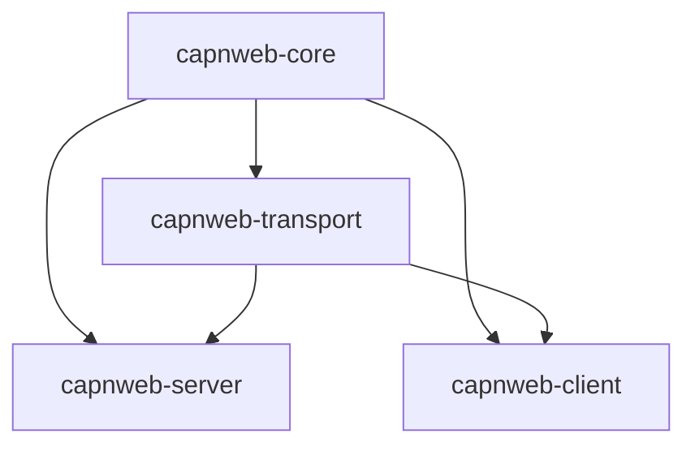

# Release Process for Cap'n Web Rust

This document describes the process for releasing new versions of the Cap'n Web Rust crates.

## Prerequisites

1. **Crates.io Account**: You need publishing rights on crates.io for all Cap'n Web crates
2. **GitHub Repository Access**: You need push access to create tags and releases
3. **API Token**: The repository must have a `CARGO_REGISTRY_TOKEN` secret configured

## Release Workflow

### 1. Prepare the Release

Before creating a release, ensure:

```bash
# All tests pass
cargo test --workspace --all-features

# Documentation builds without errors
cargo doc --workspace --no-deps --all-features

# No clippy warnings
cargo clippy --workspace --all-features -- -D warnings

# Formatting is correct
cargo fmt --all --check
```

### 2. Update Version Numbers

Update the version in all `Cargo.toml` files:

```bash
# Update version in workspace members
VERSION="0.2.0"  # Set your version here

# Update each crate's Cargo.toml
sed -i "s/^version = .*/version = \"$VERSION\"/" capnweb-core/Cargo.toml
sed -i "s/^version = .*/version = \"$VERSION\"/" capnweb-transport/Cargo.toml
sed -i "s/^version = .*/version = \"$VERSION\"/" capnweb-server/Cargo.toml
sed -i "s/^version = .*/version = \"$VERSION\"/" capnweb-client/Cargo.toml

# Update inter-crate dependencies
sed -i "s/capnweb-core = { version = \".*\"/capnweb-core = { version = \"$VERSION\"/" capnweb-*/Cargo.toml
sed -i "s/capnweb-transport = { version = \".*\"/capnweb-transport = { version = \"$VERSION\"/" capnweb-*/Cargo.toml
```

### 3. Update CHANGELOG

Create or update `CHANGELOG.md` with the new version:

```markdown
## [0.2.0] - 2025-01-28

### Added
- New features...

### Changed
- Breaking changes...

### Fixed
- Bug fixes...
```

### 4. Commit and Tag

```bash
# Commit version updates
git add -A
git commit -m "Release v$VERSION"

# Create annotated tag
git tag -a "v$VERSION" -m "Release version $VERSION"

# Push changes and tag
git push origin main
git push origin "v$VERSION"
```

### 5. Create GitHub Release

The release workflow will automatically trigger when you push a tag starting with `v`.

Alternatively, create a release manually:

1. Go to https://github.com/currentspace/capn-rs/releases/new
2. Choose the tag you just created
3. Set the release title to `v$VERSION`
4. Add release notes (can be generated from CHANGELOG.md)
5. Publish the release

### 6. Monitor the Release

The GitHub Actions workflow will:

1. **Verify** the release (version consistency, tests, docs)
2. **Publish** crates to crates.io in dependency order:
   - capnweb-core (first, as it has no internal dependencies)
   - capnweb-transport (depends on core)
   - capnweb-server (depends on core and transport)
   - capnweb-client (depends on core and transport)
3. **Create** release artifacts for multiple platforms
4. **Update** documentation

Monitor the workflow at: https://github.com/currentspace/capn-rs/actions

## Manual Publishing (Emergency)

If the automated workflow fails, you can publish manually:

```bash
# Ensure you're on the correct tag
git checkout "v$VERSION"

# Login to crates.io
cargo login $CARGO_REGISTRY_TOKEN

# Publish in dependency order
cd capnweb-core && cargo publish && cd ..
sleep 30  # Wait for crates.io indexing

cd capnweb-transport && cargo publish && cd ..
sleep 30

cd capnweb-server && cargo publish && cd ..
sleep 30

cd capnweb-client && cargo publish && cd ..
```

## Dependency Order

Crates must be published in this specific order due to dependencies:



1. **capnweb-core** - No internal dependencies
2. **capnweb-transport** - Depends on capnweb-core
3. **capnweb-server** - Depends on capnweb-core and capnweb-transport
4. **capnweb-client** - Depends on capnweb-core and capnweb-transport

## Setting up Repository Secrets

### CARGO_REGISTRY_TOKEN

1. Go to https://crates.io/settings/tokens
2. Create a new token with "publish" scope
3. Copy the token
4. Go to repository Settings → Secrets and variables → Actions
5. Add a new secret named `CARGO_REGISTRY_TOKEN` with the token value

## Versioning Policy

We follow [Semantic Versioning](https://semver.org/):

- **MAJOR** version for incompatible API changes
- **MINOR** version for backwards-compatible functionality additions
- **PATCH** version for backwards-compatible bug fixes

### Pre-release Versions

For pre-release versions:
- Alpha: `0.2.0-alpha.1`
- Beta: `0.2.0-beta.1`
- Release Candidate: `0.2.0-rc.1`

## Troubleshooting

### Crate Publishing Fails

If a crate fails to publish:

1. Check if the version already exists on crates.io
2. Ensure all dependencies are published and indexed
3. Verify the API token has not expired
4. Check for any `[patch]` sections in Cargo.toml (remove for publishing)

### Version Mismatch

If the workflow reports version mismatches:

1. Ensure all crates have the same version number
2. Update inter-crate dependency versions
3. Commit and re-tag

### Documentation Not Updating

If docs.rs doesn't update:

1. Check https://docs.rs/crate/capnweb-core/builds for build status
2. Ensure all features can be built
3. Check for documentation warnings with `cargo doc`

## Rollback Procedure

If a release has critical issues:

1. **Yank** the affected versions on crates.io (doesn't delete, just prevents new downloads):
   ```bash
   cargo yank --vers $VERSION capnweb-core
   cargo yank --vers $VERSION capnweb-transport
   cargo yank --vers $VERSION capnweb-server
   cargo yank --vers $VERSION capnweb-client
   ```

2. **Fix** the issue in a new patch version

3. **Release** the fixed version following the normal process

## Security Releases

For security fixes:

1. Prepare the fix in a private branch
2. Coordinate disclosure with users if needed
3. Release and announce simultaneously
4. Update security advisory at https://github.com/currentspace/capn-rs/security/advisories

## Checklist

Before releasing, verify:

- [ ] All CI checks pass on main branch
- [ ] Version numbers updated in all Cargo.toml files
- [ ] CHANGELOG.md updated with release notes
- [ ] Documentation is current
- [ ] No outstanding critical bugs
- [ ] Dependencies are up to date
- [ ] Examples work with the new version
- [ ] TypeScript interop tests pass

## Post-Release

After a successful release:

1. Announce on relevant channels
2. Update README.md if needed
3. Close related GitHub issues and milestones
4. Plan the next release milestone